# Olist E-commerce BI Pipeline

Projet BI / Data Engineering construit autour des donnees publiques Olist. Le projet transforme des fichiers CSV bruts en Data Warehouse analytique SQLite, puis expose les indicateurs dans un dashboard Streamlit multi-page.

## Objectif

Mettre en place une chaine decisionnelle complete et lisible :

```text
Sources CSV Olist
        |
        v
ETL Python
        |
        v
Data Warehouse SQLite
        |
        v
Dashboard BI Streamlit
```

## Problematique metier

Comment Olist peut-elle exploiter ses donnees de commandes, paiements, avis clients, produits, vendeurs et leads marketing pour suivre :

- la performance commerciale ;
- la qualite de livraison ;
- la satisfaction client ;
- l'efficacite de l'acquisition de vendeurs.

## Fonctionnalites principales

- Pipeline ETL Python depuis les fichiers CSV Olist.
- Data Warehouse SQLite avec dimensions, faits et vues analytiques.
- Deux processus metier modelises : commandes e-commerce et conversion marketing.
- Dashboard Streamlit multi-page avec KPIs, filtres et visualisations Plotly.
- Rapport qualite genere par l'ETL.
- Script de validation du projet.
- Documentation technique dans `docs/`.

## Sources attendues

Les fichiers suivants doivent etre places dans `data/raw/` :

```text
olist_orders_dataset.csv
olist_order_items_dataset.csv
olist_order_payments_dataset.csv
olist_order_reviews_dataset.csv
olist_customers_dataset.csv
olist_products_dataset.csv
olist_sellers_dataset.csv
olist_marketing_qualified_leads_dataset.csv
olist_closed_deals_dataset.csv
```

Fichier optionnel :

```text
product_category_name_translation.csv
```

Si le fichier de traduction des categories est absent, l'ETL continue et utilise les noms de categories originaux comme libelles d'analyse. Le rapport qualite indique alors `0` ligne pour cette source et ajoute la note `missing_optional_using_original_category_names`.

Le fichier `olist_geolocation_dataset.csv` n'est pas utilise dans cette version afin de garder le modele simple. Les villes et Etats deja presents dans les dimensions client et vendeur suffisent pour les analyses du dashboard.

## Installation

```bash
python -m venv .venv
source .venv/bin/activate
pip install -r requirements.txt
```

Sous Windows :

```bash
.venv\Scripts\activate
pip install -r requirements.txt
```

## Lancer l'ETL

```bash
python -m src.run_etl --raw-data-dir data/raw --warehouse-path data/warehouse/olist_dwh.sqlite
```

Le script cree ou remplace :

```text
data/warehouse/olist_dwh.sqlite
docs/data_quality_report.md
```

## Lancer le dashboard

```bash
streamlit run dashboard/app.py
```

Le dashboard lit par defaut le Data Warehouse SQLite genere dans :

```text
data/warehouse/olist_dwh.sqlite
```

## Valider le projet

```bash
python scripts/validate_project.py
```

Le script verifie :

- les imports des helpers du dashboard ;
- les tables obligatoires du Data Warehouse ;
- les vues SQL `vw_sales_monthly`, `vw_category_performance` et `vw_lead_funnel`.

## Modele Data Warehouse

Le modele conserve deux tables de faits afin de rester clair et coherent avec les processus metier :

| Table | Grain | Usage |
|---|---|---|
| `fact_order_performance` | Une ligne par article vendu dans une commande | Ventes, livraison, satisfaction, vendeurs, categories, paiements |
| `fact_lead_conversion` | Une ligne par marketing qualified lead | Acquisition vendeurs, conversion, origines marketing, segments business |

Dimensions principales :

```text
dim_date
dim_customer
dim_seller
dim_product
dim_product_category
dim_payment_type
dim_order_status
dim_lead_origin
dim_business_segment
dim_lead_type
dim_lead_profile
dim_sales_team
```

Les paiements sont agreges au niveau commande avant allocation aux lignes d'articles. Les avis clients sont aussi agreges au niveau commande pour eviter de dupliquer les reviews.

## Pages du dashboard

| Page | Contenu |
|---|---|
| Landing Page | Contexte, problematique, architecture et navigation |
| Executive Overview | KPIs globaux, revenus, commandes, avis clients et conversion des leads |
| Sales Performance | Revenus par categorie, vendeur, Etat client et mode de paiement |
| Delivery & Satisfaction | Retards, delais, notes clients et categories sensibles |
| Marketing Funnel | MQL, conversion, origines, segments, equipes commerciales |
| Data Quality | Lignes chargees, controles ETL, relations, doublons et valeurs manquantes |

## Documentation

- [Contexte projet](docs/project_context.md)
- [Pipeline ETL](docs/etl_pipeline.md)
- [Modele de donnees](docs/data_model.md)
- [Rapport dashboard](docs/dashboard_report.md)
- [Rapport qualite](docs/data_quality_report.md)

## Structure du projet

```text
olist-data-warehouse-bi-v2/
|-- dashboard/
|   |-- app.py
|   |-- db.py
|   |-- components.py
|   |-- charts.py
|   `-- pages/
|       |-- 1_Executive_Overview.py
|       |-- 2_Sales_Performance.py
|       |-- 3_Delivery_Satisfaction.py
|       |-- 4_Marketing_Funnel.py
|       `-- 5_Data_Quality.py
|-- data/
|   |-- raw/
|   `-- warehouse/
|-- docs/
|-- screenshots/
|-- scripts/
|-- sql/
|-- src/
`-- requirements.txt
```

## Screenshots

### Landing Page

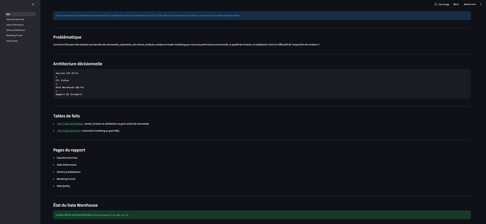

### Executive Overview

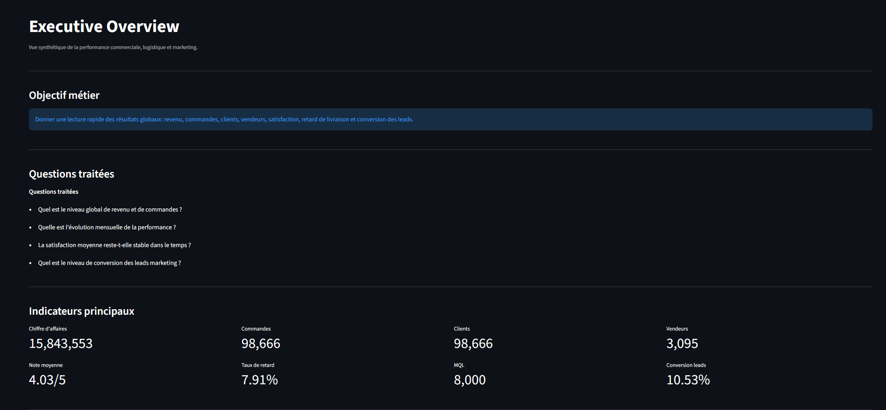

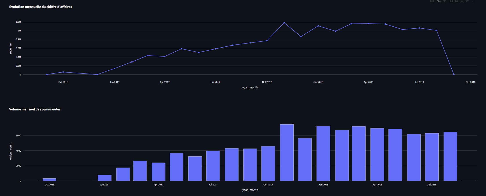

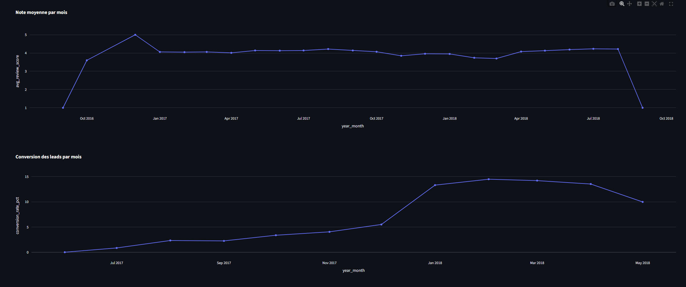

### Sales Performance

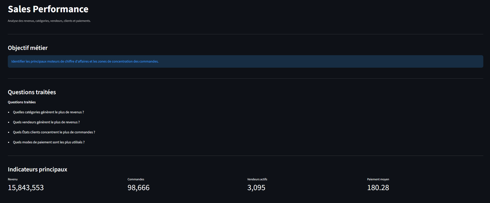

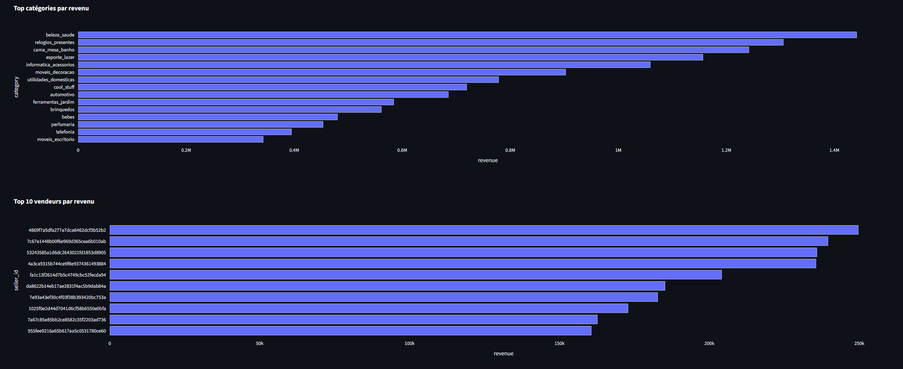

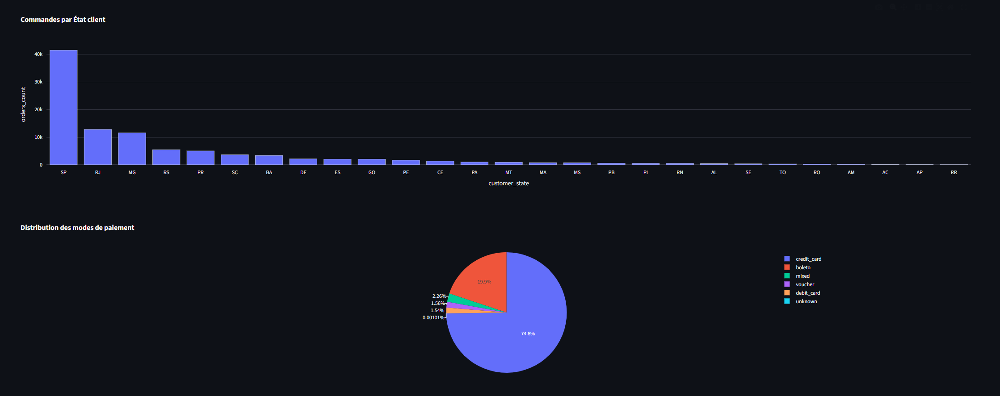

### Delivery & Satisfaction

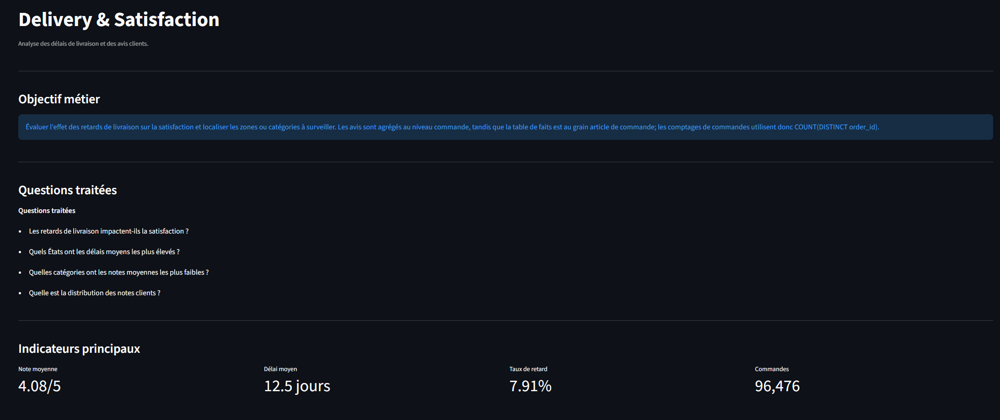

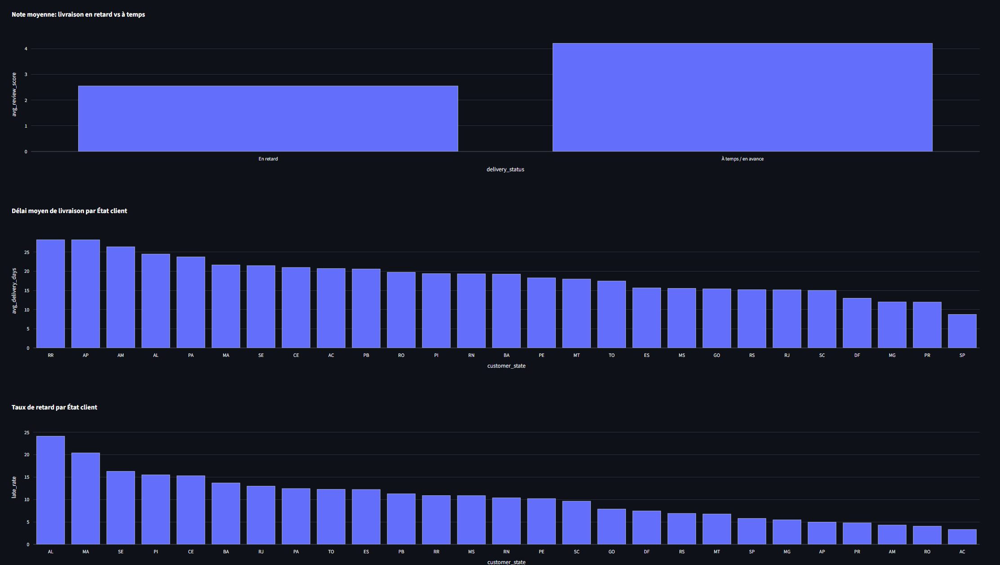

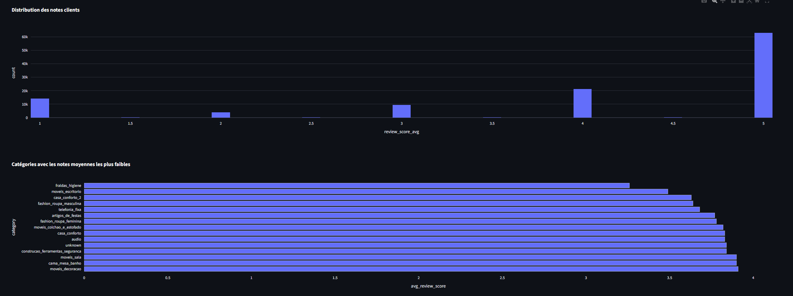

### Marketing Funnel

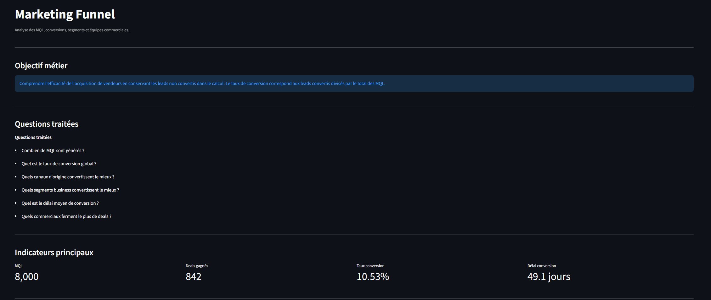

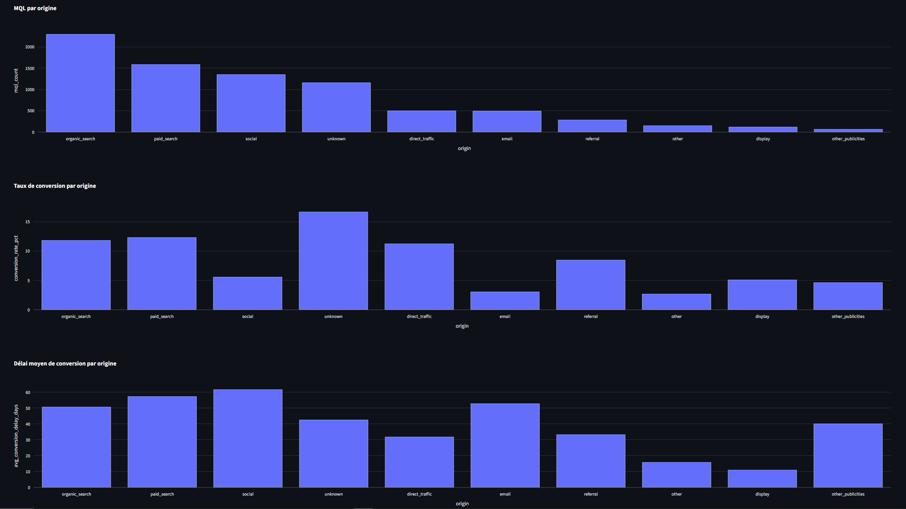

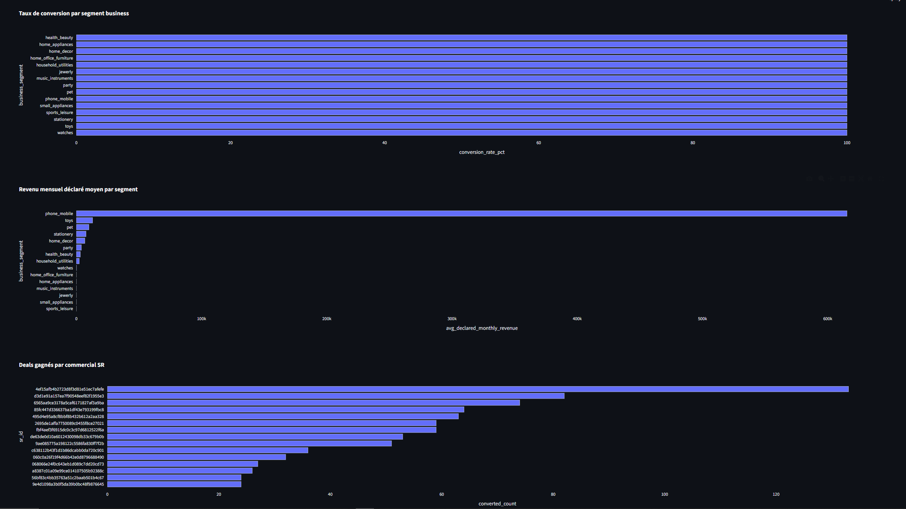

### Data Quality

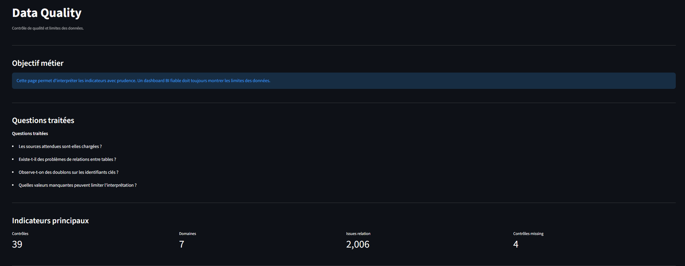

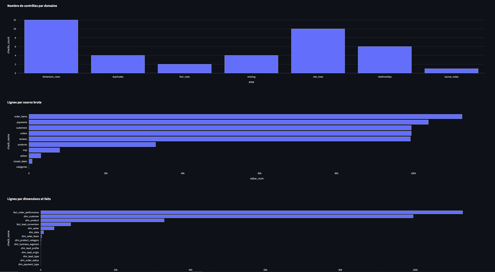

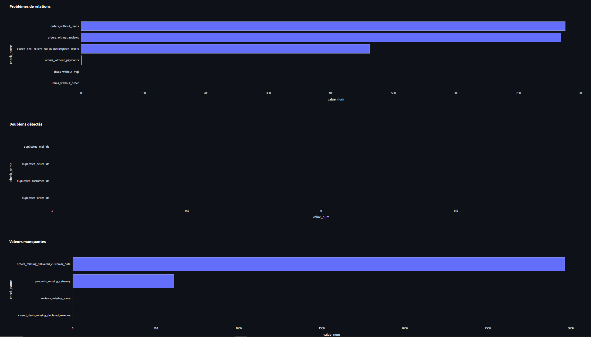

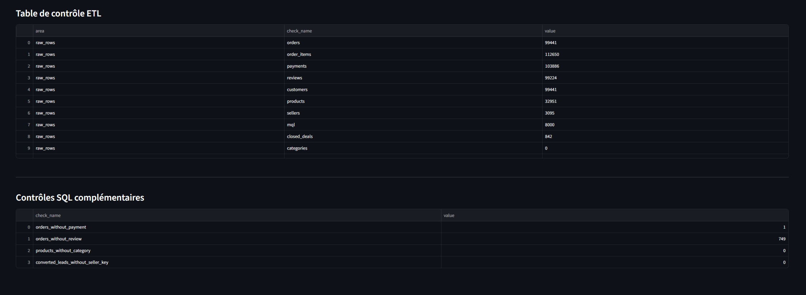

### Execution et validation

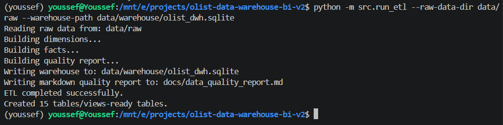

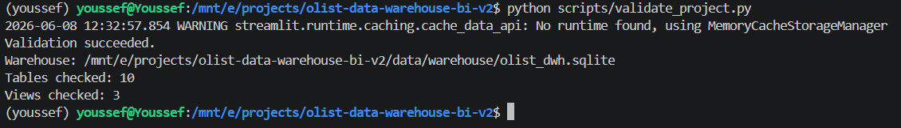

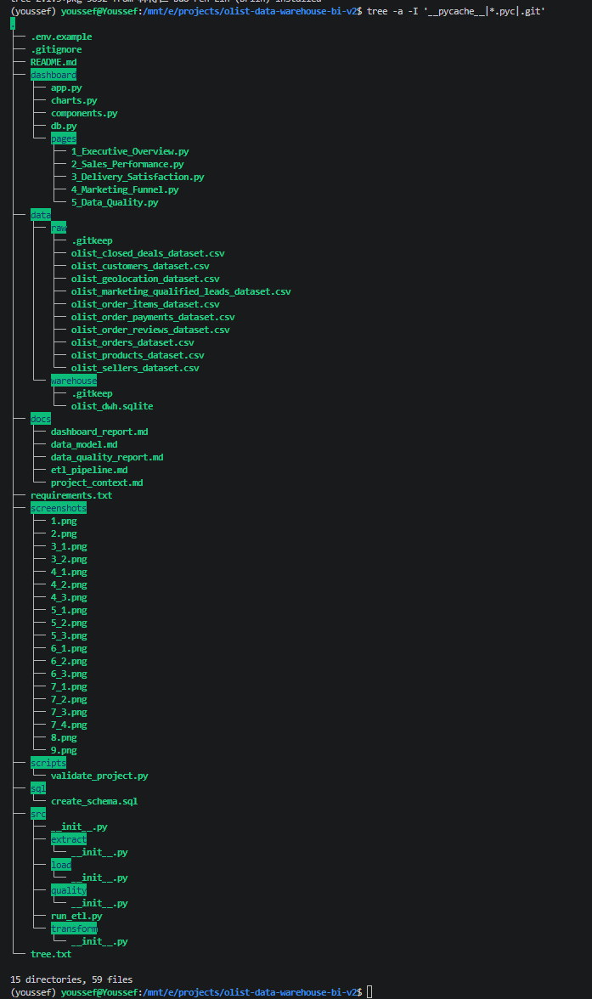
